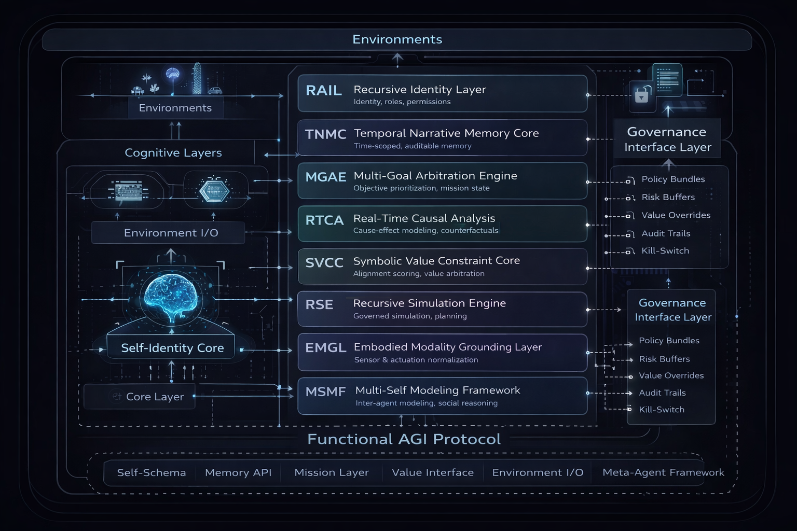

# Protocol Overview

This document provides a technical overview of the Functional AGI Protocol, including its architectural rationale, cognitive layer decomposition, and governance-first design principles.

It is intended to serve as a high-level reference for researchers, system architects, and governance reviewers before engaging with detailed schema specifications.

---

## Architectural Premise

The Functional AGI Protocol treats general intelligence as a **composable system**, not as a monolithic model.

Each cognitive function is isolated into a distinct layer, with:
- Explicit responsibilities
- Machine-readable interfaces
- Governance enforcement at boundaries

This approach enables interoperability, auditability, and controlled evolution over time.

---

## Cognitive Layer Stack

The protocol specifies eight orthogonal cognitive layers:

1. **Recursive Identity Layer (RAIL)**  
   Persistent identity, roles, and authorization scope.

2. **Temporal Narrative Memory Core (TNMC)**  
   Time-scoped episodic and semantic memory with lineage tracking.

3. **Multi-Goal Arbitration Engine (MGAE)**  
   Structured resolution of conflicting objectives under constraints.

4. **Real-Time Causal Analysis (RTCA)**  
   Auditable cause–effect modeling and counterfactual reasoning.

5. **Symbolic Value Constraint Core (SVCC)**  
   Runtime moral and policy alignment scoring.

6. **Recursive Simulation Engine (RSE)**  
   Governed future-state exploration and evaluation.

7. **Embodied Modality Grounding Layer (EMGL)**  
   Normalized interface to physical or simulated environments.

8. **Multi-Self Modeling Framework (MSMF)**  
   Social reasoning and inter-agent modeling.

Each layer is independently implementable and replaceable.

---

## Governance by Design

Safety and alignment are enforced at the protocol interface level through:
- Signed policy bundles
- Runtime value scoring
- Mission-level risk thresholds
- Tamper-evident audit logs
- Emergency halt mechanisms

This allows governance without retraining models or modifying internal weights.

---

## Scope of This Specification

This repository currently focuses on:
- Architecture
- Interface contracts
- Governance mechanisms
- Deployment pathways

Reference implementations and adapters are intentionally decoupled.

---

## Next Sections

Subsequent documents will cover:
- Detailed layer specifications
- Schema definitions
- Threat and failure models
- Deployment validation criteria

- ---

---

## Canonical Architecture Diagram

This diagram represents the authoritative architectural view of the Functional AGI Protocol,
including cognitive layers, governance enforcement at interface boundaries, and environment interaction.

